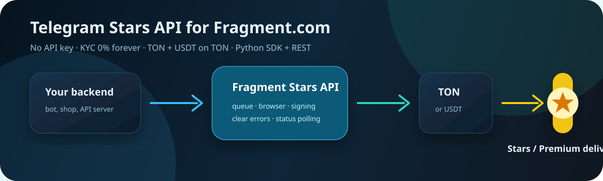

# Fragment Stars API

<p align="center">
  
  
  
</p>

**Telegram Stars API and Telegram Premium API for Fragment.com.** Buy Telegram Stars and Premium from your backend with a Python SDK or direct REST calls. Supports TON, USDT on TON, KYC and no-KYC flows, queue polling, and ready-to-copy shop examples.

<p align="center">
  <strong>LIKE IT? <a href="https://github.com/bbbuilt/fragment-stars-api">STAR IT!</a></strong>
</p>

[Russian README](README.ru.md) · [Documentation website](https://api-fragment.duckdns.org) · [Production endpoint](#production-endpoint) · [Example shop](https://github.com/bbbuilt/tg_stars_premium_shop) · [Integration help](https://github.com/bbbuilt/fragment-stars-api/issues/new?template=integration-help.yml) · [Discussions](https://github.com/bbbuilt/fragment-stars-api/discussions/2)



## Why Developers Use It

- **No API key needed**: client endpoints accept JSON requests directly; no issued token, JWT, OAuth, or `X-API-Key`.
- **KYC mode is free forever**: KYC purchases have `0%` API commission; call `get_rates()` if you want to verify rates before use.
- **TON and USDT on TON**: keep existing `payment_method="ton"` or pass `payment_method="usdt_ton"` where supported.
- **Python SDK or direct REST**: use `pip install fragment-stars-api`, or integrate from Node.js, PHP, Go, Rust, Java, or any backend via HTTP.
- **Built for Telegram shops**: queue handling, status polling, common error codes, minimal backend examples, and AI integration prompts.

## Fast Links

| Need | Start here |
|------|------------|
| Build a Telegram Stars shop | [Minimal backend example](examples/shop_minimal.py) and [shop guide](docs/telegram-stars-shop.md) |
| Use Python | [Quick Start](#quick-start) and [payment examples](examples/payment_methods.py) |
| Use direct HTTP | [REST API guide](docs/rest-api.md) and [raw REST example](examples/direct_rest_payment_methods.py) |
| Choose KYC or no-KYC | [KYC vs No-KYC guide](docs/no-kyc-vs-kyc.md) |
| Debug a client error | [Errors guide](docs/errors.md) |
| Let Codex or Claude integrate it | [Codex skill](CODEX_SKILL.md) / [Claude skill](CLAUDE_SKILL.md) |
| Need help | [Open integration help issue](https://github.com/bbbuilt/fragment-stars-api/issues/new?template=integration-help.yml) or contact [@makecodev](https://t.me/makecodev) |

## Production Endpoint

Use this base URL for SDK and direct HTTP calls:

```text
https://fragment-api.ydns.eu:8443
```

Health check:

```bash
curl https://fragment-api.ydns.eu:8443/health
```

Client endpoints do **not** require `Authorization`, `X-API-Key`, JWT, OAuth, or issued API tokens. The API tracks commission by the TON wallet derived from the provided seed. Internal admin endpoints are separate and are not needed for client integrations.

## Build a Telegram Stars Shop in 10 Minutes

1. Install the SDK on your backend.
2. Store `FRAGMENT_WALLET_SEED` in backend environment variables only.
3. Accept `username` and `amount` from your bot/shop.
4. Call `client.buy_stars("@telegram_user", amount, seed=...)`.
5. Return the final status to your user.

Runnable minimal backend:

```bash
pip install fastapi uvicorn fragment-stars-api
export FRAGMENT_WALLET_SEED="base64_seed_phrase"
uvicorn examples.shop_minimal:app --host 0.0.0.0 --port 8000
```

Full guide: [docs/telegram-stars-shop.md](docs/telegram-stars-shop.md). Production-ready shop example: [bbbuilt/tg_stars_premium_shop](https://github.com/bbbuilt/tg_stars_premium_shop).

## Installation

```bash
pip install fragment-stars-api
```

## Quick Start

```python
from fragment_api import FragmentAPIClient

client = FragmentAPIClient("https://fragment-api.ydns.eu:8443")

result = client.buy_stars(
    username="@telegram_user",
    amount=100,
    seed="your_wallet_seed_base64",
    payment_method="ton",
)

if result.success:
    print(f"Sent {result.amount} Stars")
    print(result.transaction_hash or result.transaction_id)
else:
    print(result.error)
```

## Use Cases

| Use case | Recommended path |
|----------|------------------|
| Telegram Stars shop or bot | Use `buy_stars()` from backend and poll queue automatically with SDK. |
| KYC user has Fragment cookies | Pass `fragment_cookies` / `cookies`; API commission stays `0%`. |
| Client does not want cookies | Omit cookies and use no-KYC mode. |
| Client wants USDT pricing | Pass `payment_method="usdt_ton"` for supported Stars flows. |
| Non-Python stack | Use direct REST endpoints; no API key is needed. |
| AI/vibe coding integration | Add `CODEX_SKILL.md` or `CLAUDE_SKILL.md` to the client project first. |

## KYC vs No-KYC

| Mode | Cookies required | API commission | Good for |
|------|------------------|----------------|----------|
| KYC | Yes, user's Fragment cookies | `0%` forever | Lowest cost, users comfortable with Fragment cookies |
| No-KYC | No | Commission applies | Fast onboarding, shops that do not want user cookies |

KYC can use `ton` or `usdt_ton`. No-KYC Stars can use `ton` or `usdt_ton`; with USDT, Stars base price is paid in USDT on TON and API commission is paid in TON. More detail: [docs/no-kyc-vs-kyc.md](docs/no-kyc-vs-kyc.md).

## Python SDK vs Direct REST

| Option | Best for | Example |
|--------|----------|---------|
| Python SDK | Python bots, FastAPI, Django, background workers | [examples/payment_methods.py](examples/payment_methods.py) |
| Direct REST | Node.js, PHP, Go, Laravel, Java, Rust, custom backends | [docs/rest-api.md](docs/rest-api.md) |
| Minimal shop backend | Fastest copy-paste backend start | [examples/shop_minimal.py](examples/shop_minimal.py) |

## Runnable Examples

- [examples/shop_minimal.py](examples/shop_minimal.py) - shortest backend shop: accept `username`/`amount`, buy Stars.
- [examples/payment_methods.py](examples/payment_methods.py) - KYC / no-KYC with TON and USDT on TON.
- [examples/direct_rest_payment_methods.py](examples/direct_rest_payment_methods.py) - the same four flows with raw HTTP JSON.
- [examples/javascript_fetch.js](examples/javascript_fetch.js) - direct REST from Node.js 18+.
- [examples/php_curl.php](examples/php_curl.php) - direct REST from PHP cURL.
- [examples/go_net_http.go](examples/go_net_http.go) - direct REST from Go `net/http`.
- [examples/with_kyc.py](examples/with_kyc.py) - Fragment cookies setup for KYC mode.

## API Reference

### Direct HTTP Endpoints

Send JSON only. No API key or auth header is required.

| Method | Path | Purpose | Required JSON |
|--------|------|---------|---------------|
| `POST` | `/api/v1/stars/buy` | Buy Stars through the queue | `username`, `amount`, `seed` |
| `GET` | `/api/v1/queue/{request_id}` | Poll a Stars request | none |
| `POST` | `/api/v1/premium/buy` | Buy Premium | `username`, `duration`, `seed` |
| `POST` | `/api/v1/premium/check-eligibility` | Check Premium availability | `username` |
| `GET` | `/api/v1/prices` | Get TON and USDT-on-TON prices | none |
| `GET` | `/api/v1/commission/rates` | Check commission rates | none |

Optional purchase fields: `fragment_cookies`, `fragment_local_storage`, `payment_method`. Default `payment_method` is `ton`; use `usdt_ton` for USDT on TON where supported.

### FragmentAPIClient

```python
FragmentAPIClient(
    base_url: str,
    timeout: float = 30.0,
    poll_timeout: float = 300.0,
)
```

| Method | Description |
|--------|-------------|
| `buy_stars(username, amount, seed, cookies?, local_storage?, payment_method?, wait?)` | Buy Telegram Stars through the queue |
| `buy_premium(username, duration, seed, cookies?, local_storage?, payment_method?, wait?)` | Buy Telegram Premium directly |
| `get_prices()` | Get current TON and USDT-on-TON prices |
| `get_rates()` | Get commission rates |
| `get_queue_status()` | Get queue status and statistics |
| `check_premium_eligibility(username)` | Check if user is eligible for Premium |
| `get_status(request_id)` | Get request status |

## Common Client Mistakes

| Mistake | Correct approach |
|---------|------------------|
| Asking for an API token | Do not use API tokens for client endpoints. Send JSON to the production endpoint. |
| Sending seed from frontend | Keep seed and cookies on backend only. Never expose them in a browser or mobile app. |
| Retrying blindly after an uncertain transaction | Check wallet/TON explorer first. A blind retry can duplicate purchases. |
| Passing username without `@` in direct REST | Use `@telegram_user` format unless your SDK normalizes it. |
| Using KYC without `stel_ton_token` | Connect wallet on Fragment first, then export cookies. |

Full troubleshooting: [docs/errors.md](docs/errors.md).

## Common Errors

| Error | Meaning | What to do |
|-------|---------|------------|
| `VALIDATION_ERROR` | Bad request body, wrong username format, unsupported amount or payment method | Fix the request; usernames should look like `@telegram_user`. |
| `INVALID_SEED` / `INVALID_WALLET_SEED` | Wallet seed is missing, malformed, or not base64 encoded correctly | Re-encode the 24-word seed on the backend. |
| `INSUFFICIENT_BALANCE` / `INSUFFICIENT_WALLET_BALANCE` | Wallet has too little TON, USDT on TON, or gas balance | Top up the wallet before creating a new request. |
| `USER_NOT_FOUND` / `TELEGRAM_USER_NOT_FOUND` | Fragment could not find the Telegram user | Check the username and try a new request. |
| `FRAGMENT_ADDITIONAL_VERIFICATION_REQUIRED` | Fragment asks the account for extra verification | Open Fragment manually with that account/cookies and complete the check. |
| `TEMPORARY_FRAGMENT_CONNECTION_ERROR` | Temporary connection problem between the API server and Fragment.com | Submit a new request later. Do not reuse the old `request_id`. |
| `TEMPORARY_FRAGMENT_FORM_NOT_READY` | Fragment page or form did not become ready in time | Submit a new request later. |
| `TON_TRANSACTION_CONFIRMATION_UNCERTAIN` | Transaction signing/sending may be uncertain | Check the wallet/TON explorer before retrying. |

## Fragment Cookies for KYC Mode

KYC mode requires Fragment.com cookies and has **0% API commission permanently**.

Required cookies:

- `stel_token`
- `stel_ssid`
- `stel_ton_token`
- `stel_dt`

Read the full guide: [COOKIES_GUIDE.md](COOKIES_GUIDE.md). If you do not want to handle cookies, use no-KYC mode by omitting the `cookies` parameter.

## Vibe Coding / AI Agent Setup

If a client integrates with Codex, Claude, Cursor, or another AI coding agent, give the agent a ready-made skill file first. It prevents invented API tokens, frontend seed leaks, cookie leaks, and duplicate purchases from blind retries.

- Codex: add [CODEX_SKILL.md](CODEX_SKILL.md) to the client project and reference it from `AGENTS.md`.
- Claude: add [CLAUDE_SKILL.md](CLAUDE_SKILL.md) to the client project or copy it into `CLAUDE.md`.
- AI-readable docs: [llms.txt](https://api-fragment.duckdns.org/llms.txt) / [llms-full.txt](https://api-fragment.duckdns.org/llms-full.txt).

## Need Help Integrating?

- Open an [Integration Help issue](https://github.com/bbbuilt/fragment-stars-api/issues/new?template=integration-help.yml).
- Contact Telegram: [@makecodev](https://t.me/makecodev).
- Show your implementation or ask for feedback in [Integration help / Show your shop](https://github.com/bbbuilt/fragment-stars-api/discussions/2).

## Contributing

Issues and integration feedback are welcome. See [CONTRIBUTING.md](CONTRIBUTING.md) and [SECURITY.md](SECURITY.md). Do not post wallet seeds, Fragment cookies, private keys, or production customer data in public issues.

## Author

**Basebay** - backend developer focused on automation, bots, and infrastructure tools.

- Telegram: [@makecodev](https://t.me/makecodev)
- GitHub: [bbbuilt](https://github.com/bbbuilt)

## License

MIT License - see [LICENSE](LICENSE).
