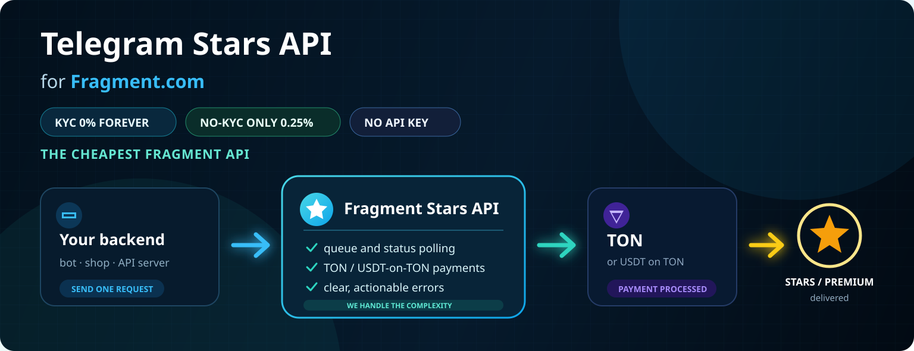

# Fragment Stars API

<div align="center">

## САМОЕ ДЕШЁВОЕ FRAGMENT API

### KYC 0% · БЕЗ KYC 0,25%

**Публичные ставки. Без API ключа. Проверка через [`GET /api/v1/commission/rates`](https://api.fragment-api.space/api/v1/commission/rates).**

**Current SDK: `v2.1.5`**

</div>

<p align="center">
  <strong>Telegram Stars API для Fragment.com</strong><br>
  Покупайте Telegram Stars и Premium с backend через Python SDK или прямой REST.<br>
  Без API ключа. KYC 0% навсегда. Без KYC всего 0,25%. TON + USDT on TON.
</p>

<p align="center">
  <a href="https://pypi.org/project/fragment-stars-api/"></a>
  
  <a href="https://fragment-api.space"></a>
  <a href="https://github.com/bbbuilt/fragment-stars-api"></a>
  
</p>

<p align="center">
  <a href="#быстрый-старт"><strong>Быстрый старт</strong></a> ·
  <a href="examples/shop_minimal.py"><strong>Minimal Shop</strong></a> ·
  <a href="docs/rest-api.md"><strong>REST API</strong></a> ·
  <a href="docs/no-kyc-vs-kyc.md"><strong>KYC vs No-KYC</strong></a> ·
  <a href="https://github.com/bbbuilt/tg_stars_premium_shop"><strong>Пример магазина</strong></a> ·
  <a href="README.md"><strong>EN</strong></a>
</p>

<p align="center">
  
</p>

## Что вы получаете

<table>
  <tr>
    <td width="25%"><strong>API ключ не нужен</strong><br>Клиентские endpoints принимают JSON напрямую. Не нужен token, JWT, OAuth или <code>X-API-Key</code>.</td>
    <td width="25%"><strong>Минимальная комиссия</strong><br>KYC <code>0%</code> навсегда, без KYC всего <code>0,25%</code>. Проверка через <code>get_rates()</code>.</td>
    <td width="25%"><strong>TON + USDT</strong><br>Используйте default <code>ton</code> или передавайте <code>usdt_ton</code>, где поддерживается.</td>
    <td width="25%"><strong>SDK + REST</strong><br>Python пакет и raw HTTP examples для Node.js, PHP, Go и любого backend.</td>
  </tr>
</table>

## Куда нажать сначала

| Если нужно... | Откройте |
|---------------|----------|
| Собрать Telegram Stars магазин | [Минимальный backend](examples/shop_minimal.py) и [гайд магазина](docs/telegram-stars-shop.md) |
| Скопировать raw HTTP calls | [REST API guide](docs/rest-api.md) и [direct REST example](examples/direct_rest_payment_methods.py) |
| Выбрать KYC или no-KYC | [KYC vs No-KYC guide](docs/no-kyc-vs-kyc.md) |
| Разобрать ошибку API | [Errors guide](docs/errors.md) |
| Интегрировать через Codex или Claude | [Codex skill](CODEX_SKILL.md) / [Claude skill](CLAUDE_SKILL.md) |
| Нужна помощь | [Integration Help issue](https://github.com/bbbuilt/fragment-stars-api/issues/new?template=integration-help.yml) или [@makecodev](https://t.me/makecodev) |

## Production Endpoint

```text
https://api.fragment-api.space
```

```bash
curl https://api.fragment-api.space/health
```

Адрес работает через стандартный HTTPS-порт `443`, включая сети, которые блокируют нестандартные порты. Легаси-адреса `https://api-fragment.duckdns.org` и `https://fragment-api.ydns.eu:8443` остаются совместимыми.

Клиентские endpoints **не требуют** `Authorization`, `X-API-Key`, JWT, OAuth или выданных API токенов. API учитывает комиссию по TON кошельку, который получается из переданного seed.

## Быстрый старт

```bash
pip install fragment-stars-api
```

```python
from fragment_api import FragmentAPIClient

client = FragmentAPIClient()  # Использует https://api.fragment-api.space

result = client.buy_stars(
    username="@telegram_user",
    amount=100,
    seed="your_wallet_seed_base64",
    payment_method="ton",
)

if result.success:
    print(f"Sent {result.amount} Stars")
    print(result.transaction_hash or result.transaction_id)
else:
    print(result.error)
```

Для self-hosted или legacy endpoint передайте адрес явно: `FragmentAPIClient(base_url)`.

## Telegram Stars магазин за 10 минут

1. Установите SDK на backend.
2. Храните `FRAGMENT_WALLET_SEED` только в backend environment variables.
3. Принимайте `username` и `amount` от бота/магазина.
4. Вызывайте `client.buy_stars("@telegram_user", amount, seed=...)`.
5. Возвращайте финальный статус пользователю.

Минимальный backend:

```bash
pip install fastapi uvicorn fragment-stars-api
export FRAGMENT_WALLET_SEED="base64_seed_phrase"
uvicorn examples.shop_minimal:app --host 0.0.0.0 --port 8000
```

Полный гайд: [docs/telegram-stars-shop.md](docs/telegram-stars-shop.md). Production-ready пример магазина: [bbbuilt/tg_stars_premium_shop](https://github.com/bbbuilt/tg_stars_premium_shop).

## Сценарии использования

| Сценарий | Рекомендуемый путь |
|----------|--------------------|
| Telegram Stars магазин или бот | Вызывайте `buy_stars()` на backend, SDK сам опрашивает очередь. |
| У пользователя есть Fragment cookies | Передайте `fragment_cookies` / `cookies`; комиссия API остаётся `0%`. |
| Клиент не хочет cookies | Не передавайте cookies и используйте no-KYC режим. |
| Нужна цена в USDT | Передайте `payment_method="usdt_ton"` для поддерживаемых Stars flow. |
| Backend не на Python | Используйте прямые REST endpoints; API ключ не нужен. |
| Интеграция через AI/vibe coding | Сначала добавьте `CODEX_SKILL.md` или `CLAUDE_SKILL.md` в проект клиента. |

## KYC vs No-KYC

| Режим | Cookies нужны | Комиссия API | Когда использовать |
|-------|---------------|--------------|--------------------|
| KYC | Да, Fragment cookies пользователя | `0%` навсегда | Минимальная стоимость, пользователь готов передать Fragment cookies |
| No-KYC | Нет | `0,25%` | Быстрый старт, магазин не хочет работать с cookies пользователя |

KYC принимает `ton` или `usdt_ton`. No-KYC Stars принимает `ton` или `usdt_ton`; при USDT базовая цена Stars оплачивается в USDT on TON, а комиссия API — в TON. Подробнее: [docs/no-kyc-vs-kyc.md](docs/no-kyc-vs-kyc.md).

Комиссия no-KYC накапливается отдельно для каждого TON-кошелька, поэтому для каждого заказа больше не создаётся мелкая транзакция комиссии. Списание начинается, когда накопленный баланс достигает `1 TON`: при оплате в TON вся накопленная комиссия включается в основной prepayment, а при покупке Stars за USDT on TON выполняется одна отдельная TON-транзакция при достижении порога. Актуальный долг возвращается в поле `commission_balance_ton`.

## Python SDK vs Direct REST

| Вариант | Для чего | Пример |
|---------|----------|--------|
| Python SDK | Python боты, FastAPI, Django, workers | [examples/payment_methods.py](examples/payment_methods.py) |
| Direct REST | Node.js, PHP, Go, Laravel, Java, Rust, custom backend | [docs/rest-api.md](docs/rest-api.md) |
| Minimal shop backend | Самый быстрый copy-paste backend | [examples/shop_minimal.py](examples/shop_minimal.py) |

## Готовые примеры

- [examples/shop_minimal.py](examples/shop_minimal.py) - самый короткий backend магазин: принять `username`/`amount`, купить Stars.
- [examples/payment_methods.py](examples/payment_methods.py) - KYC / no-KYC с TON и USDT on TON.
- [examples/direct_rest_payment_methods.py](examples/direct_rest_payment_methods.py) - те же режимы через обычный HTTP JSON.
- [examples/javascript_fetch.js](examples/javascript_fetch.js) - прямой REST из Node.js 18+.
- [examples/php_curl.php](examples/php_curl.php) - прямой REST из PHP cURL.
- [examples/go_net_http.go](examples/go_net_http.go) - прямой REST из Go `net/http`.
- [examples/with_kyc.py](examples/with_kyc.py) - настройка Fragment cookies для KYC режима.

## API Reference

### Прямые HTTP Endpoints

Отправляйте только JSON. API key и auth header не нужны.

| Method | Path | Для чего | Обязательный JSON |
|--------|------|----------|-------------------|
| `POST` | `/api/v1/stars/buy` | Купить Stars через очередь | `username`, `amount`, `seed` |
| `GET` | `/api/v1/queue/{request_id}` | Проверить Stars request | нет |
| `POST` | `/api/v1/premium/buy` | Купить Premium | `username`, `duration`, `seed` |
| `POST` | `/api/v1/premium/check-eligibility` | Проверить доступность Premium | `username` |
| `GET` | `/api/v1/prices` | Получить цены TON и USDT-on-TON | нет |
| `GET` | `/api/v1/commission/rates` | Проверить ставки комиссии | нет |

Опциональные поля покупки: `fragment_cookies`, `fragment_local_storage`, `payment_method`. По умолчанию `payment_method` равен `ton`; используйте `usdt_ton` для USDT on TON, где поддерживается.

### FragmentAPIClient

```python
FragmentAPIClient(
    base_url: str,
    timeout: float = 30.0,
    poll_timeout: float = 300.0,
)
```

| Метод | Описание |
|-------|----------|
| `buy_stars(username, amount, seed, cookies?, local_storage?, payment_method?, wait?)` | Купить Telegram Stars через очередь |
| `buy_premium(username, duration, seed, cookies?, local_storage?, payment_method?, wait?)` | Купить Telegram Premium напрямую |
| `get_prices()` | Получить текущие цены в TON и USDT-on-TON |
| `get_rates()` | Получить ставки комиссии |
| `get_queue_status()` | Получить статус очереди и статистику |
| `check_premium_eligibility(username)` | Проверить доступность Premium для пользователя |
| `get_status(request_id)` | Получить статус request |

## Частые ошибки клиентов

| Ошибка | Как правильно |
|--------|---------------|
| Искать API token | Для клиентских endpoints токены не нужны. Отправляйте JSON на production endpoint. |
| Отправлять seed из frontend | Seed и cookies должны быть только на backend. Никогда не показывайте их браузеру или mobile app. |
| Слепо повторять после uncertain transaction | Сначала проверьте кошелёк/TON explorer. Слепой retry может сделать дубль покупки. |
| Передавать username без `@` | Используйте `@telegram_user` и в Python SDK, и в direct REST. |
| Запрашивать меньше 50 Stars | Минимум Fragment — 50. SDK отклонит меньшее количество до запроса или оплаты. |
| Использовать KYC без `stel_ton_token` | Сначала подключите кошелёк на Fragment, потом экспортируйте cookies. |
| Превышать лимит no-KYC invoices | Один кошелёк может создать до `300` no-KYC платёжных invoices в час. При `RATE_LIMIT_EXCEEDED` ждите время из `Retry-After`; не запускайте автоматический цикл повторов. |

Полный troubleshooting: [docs/errors.md](docs/errors.md).

## Частые ошибки API

| Ошибка | Что значит | Что делать |
|--------|------------|------------|
| `VALIDATION_ERROR` | Неверное тело запроса, формат username, amount или payment method | Исправить запрос; username должен выглядеть как `@telegram_user`. |
| `INVALID_FRAGMENT_COOKIES` / `INVALID_FRAGMENT_LOCAL_STORAGE` | Данные сессии не являются Base64-encoded JSON | Повторно экспортировать JSON и закодировать полное значение в Base64. |
| `API_BUSY` | Уже выполняется другая Premium-покупка в браузере | Дождаться завершения и отправить новый запрос. Не повторять автоматически. |
| `RATE_LIMIT_EXCEEDED` | Кошелёк создал 300 no-KYC платёжных invoices за час | Дождаться времени из `Retry-After` перед новым запросом. Не повторять автоматически. |
| `INVALID_SEED` / `INVALID_WALLET_SEED` | Seed кошелька отсутствует, битый или неверно закодирован в base64 | Заново закодировать 24 слова seed на backend. |
| `INSUFFICIENT_BALANCE` / `INSUFFICIENT_WALLET_BALANCE` | На кошельке мало TON, USDT on TON или TON для газа | Пополнить кошелёк и создать новый request. |
| `USER_NOT_FOUND` / `TELEGRAM_USER_NOT_FOUND` | Fragment не нашёл Telegram пользователя | Проверить username и создать новый request. |
| `FRAGMENT_ADDITIONAL_VERIFICATION_REQUIRED` | Fragment просит дополнительную проверку аккаунта | Открыть Fragment вручную с этим аккаунтом/cookies и пройти проверку. |
| `TEMPORARY_FRAGMENT_CONNECTION_ERROR` | Временная проблема связи API сервера с Fragment.com | Повторить позже новым request. Старый `request_id` не переиспользовать. |
| `TEMPORARY_FRAGMENT_FORM_NOT_READY` | Страница или форма Fragment не успела стать готовой | Повторить позже новым request. |
| `TON_TRANSACTION_CONFIRMATION_UNCERTAIN` | Неясно, была ли подписана/отправлена транзакция | Сначала проверить кошелёк/TON explorer. |

## Fragment Cookies для KYC режима

KYC режим требует Fragment.com cookies и имеет **0% комиссии API навсегда**.

Нужные cookies:

- `stel_token`
- `stel_ssid`
- `stel_ton_token`
- `stel_dt`

Полный гайд: [COOKIES_GUIDE.ru.md](COOKIES_GUIDE.ru.md). Если не хотите работать с cookies, используйте no-KYC режим без параметра `cookies`.

## Vibe Coding / AI Agent Setup

Если клиент интегрирует API через Codex, Claude, Cursor или другой AI coding agent, сначала дайте агенту готовый skill-файл. Это защищает от придуманных API токенов, seed в frontend коде, утечек cookies и дублей из-за слепого retry.

- Codex: добавьте [CODEX_SKILL.md](CODEX_SKILL.md) в проект клиента и подключите его из `AGENTS.md`.
- Claude: добавьте [CLAUDE_SKILL.md](CLAUDE_SKILL.md) в проект клиента или скопируйте в `CLAUDE.md`.
- AI-readable docs: [llms.txt](https://fragment-api.space/llms.txt) / [llms-full.txt](https://fragment-api.space/llms-full.txt).

## Нужна помощь с интеграцией?

- Откройте [Integration Help issue](https://github.com/bbbuilt/fragment-stars-api/issues/new?template=integration-help.yml).
- Напишите в Telegram: [@makecodev](https://t.me/makecodev).
- Покажите реализацию или задайте вопрос в [Integration help / Show your shop](https://github.com/bbbuilt/fragment-stars-api/discussions/2).

## Contributing

Issues и feedback по интеграции приветствуются. См. [CONTRIBUTING.md](CONTRIBUTING.md) и [SECURITY.md](SECURITY.md). Не публикуйте seed фразы, Fragment cookies, private keys или production customer data в публичных issues.

## Автор

**Basebay** - backend-разработчик, специализирующийся на автоматизации, ботах и infrastructure tools.

- Telegram: [@makecodev](https://t.me/makecodev)
- GitHub: [bbbuilt](https://github.com/bbbuilt)

## Лицензия

MIT License - см. [LICENSE](LICENSE).
